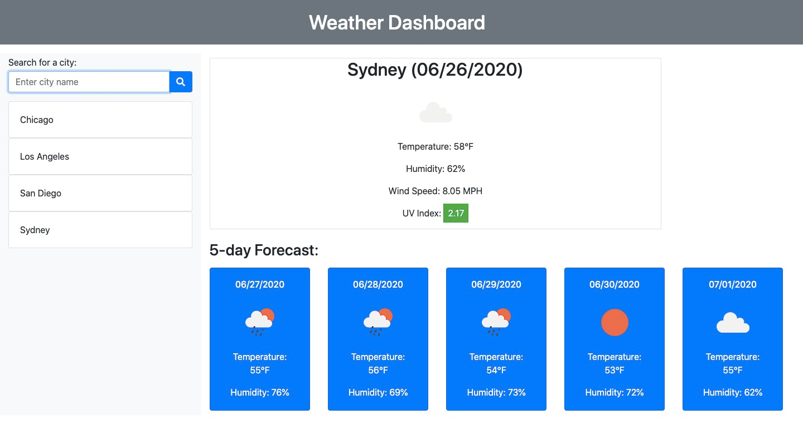

# Weather Dashboard
An up-to-date weather forecast of any city! 

## Table of contents
* [General info](#general-info)
* [Screenshots](#screenshots)
* [URL](#url)
* [Code](#code)
* [Status](#status)
* [Inspiration](#inspiration)
* [Contact](#contact)

## General info
The purpose is to display the current weather and five day forecast for a searched city. The searched cities will also be saved!

## Screenshot

## URL
[Weather Dashboard](https://achigas.github.io/Weather-Dashboard-Chal6/)

## Code
* HTML
* CSS
* Javascript

## Status
Project is complete. 

## Inspiration
Alex Chigas. Project inspired by UCLAx Challenge 6.

## Contact
Created by Alex Chigas. 